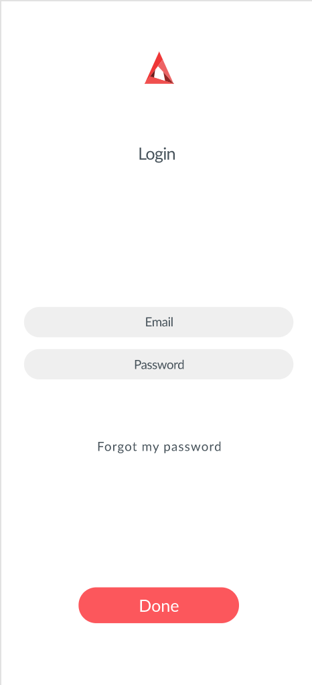
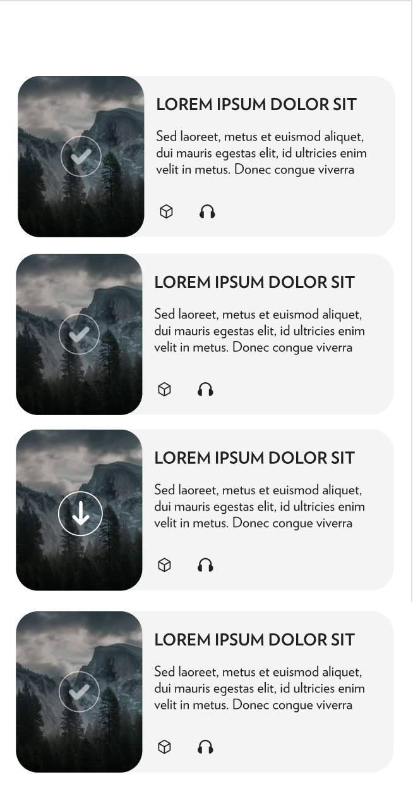
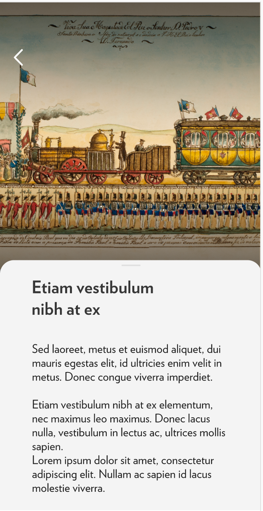

{width=50px}\

# X-Plora Android Challenge
**X-Plora development team**


We are happy and thankful you agreed to this challenge and know you are eager to show us your skills. In the results, we will evaluate from the ability to implement graphics layouts to the way you resolve the login in the tasks. 

There will be 2 main tasks and one bonus to be resolved with whatever tools of your choice.


## Submission
If not stated otherwise you´ll have 72 hours to submit this challenge. Completness is desirable but not mandatory.
- Fork this repository [https://github.com/Xplora/android-challenge](https://github.com/Xplora/android-challenge) 
- Make a commit for each task completed
- Make a pull request for the final submission


## Assets
Find all the needed assets in the assets folder. Should you not find a suitable format for your workflow please indicate so and avoid investing time in formatting it yourself.


## Tasks
Each task will be represented by a Screen layout will some actions associated with them. You will be connecting to one of our api´s. You will implement one of our bread and butter, login to our backend, and retrieve a list of modules. The bonus task is to implement the Module view.

### Login taks
This first taks is a simple login screen that will authenticate with our demo server. Follow this image to implement the layout:

{ width=50% }

Take the followind endpoint:
```
http://demo.goxplora.com/api/login
```
Via POST resques send the next variables:
```
email=demos@goxplora.com
password=demo1234
```
This endpoint responds to a sucessfull request like this:
```javascript
{
    "code": 0,
    "data": {
        "user": {
            "id": 9,
            "name": "Demo 21",
            "email": "demo@goxplora.com",
            "avatar": "uploads/avatars/9_avatar1614262805.jpg",
            "api_token": "Wndinb4ouezGHjw35mkzEAiGIwCrUfJlKkx1WSUG",
            ...
        }
    },
    "errors": null
}
```     
Save the `api_token` in available fot he next taks


### Module list
Once you got the `api_token` from the server, use it in order to retrieve a list of modules from it.  
The endpoint:
```
http://demo.goxplora.com/api/modules
```
Send  `api_token=value_from_server`  as a post variable.
Expect the response to have at least this structure:
```json
{
    "code": 0,
    "data": {
        "modules": [
            ...,
            {
                "id": 3,
                "title": {
                    "en": "...",
                    "fr": "...",
                    "de": "...",
                    "pt": "...",
                    "es": "..."
                },
              "images": {
                    "en": [
                        {
                            "url": "...",
                            "url_thumb": "..."
                        }
                    ],
                    "fr": [
                        {
                            "url": "...",
                            "url_thumb": "..."
                        }
                    ],
                    "de": [
                        {
                            "url": "...",
                            "url_thumb": "..."
                        }
                    ],
                    "pt": [
                        {
                            "url": "..",
                            "url_thumb": "..."
                        }
                    ],
                    "es": [
                        {
                            "url": "...",
                            "url_thumb": "..."
                        }
                    ]
                },
                "content": {
                    "en": "...",
                    "fr": "...",
                    "pt": "...",
                    "es": "...",
                    "de": "..."
                },
            },
            ...
        ]
    }
}
```

Use the `data.modules` structure to fill a list following the next layout as close as possible:  

{ width=70% }

Notes:
- Use the language key of your choice.
- Use the first image from `data.modules.images` for the list item.
- Image, text, content and round corners are expected.
- Icons are extras fot his task.


### Module View
This task includes adding interaction to the previous list to select an item and show its content in another layout. The layout includes a back button that must return to the previous list screen.

Follow this image to implement the layout: 

{ width=70% }


